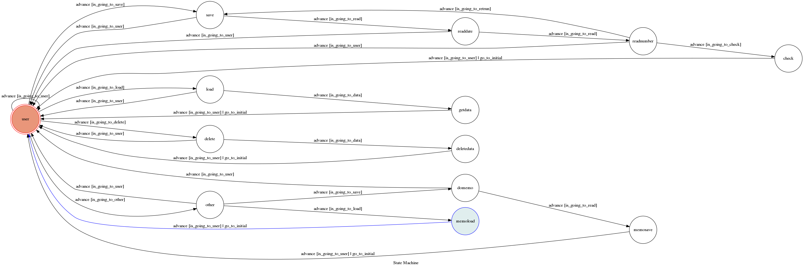

# TOC Project 2019
## Finite State Machine

## Usage
The initial state is set to `user`.

輸入'..'可回到user。

初始輸入'..'由user開始可選擇四個選項，存檔、讀檔以及刪除，用來儲存支出紀錄（一天只能存一筆）也可儲存備忘錄，

若選擇存檔，則開始記錄日期以及當天支出，若最後沒確認儲存則回到選擇日期的步驟，確認儲存後則回到user。

若選擇讀檔，則輸入欲讀取之日期，若輸入日期無資料則卡在此步驟，若有資料則把資料內容作輸出，然後回到user。

若選擇刪除，則輸入欲刪除之日期，若輸入日期無資料則卡在此步驟，若有資料則刪除後回到user。

* user
	* Input: "請選擇存檔或讀檔或刪除或備忘錄"
		* Reply: "存檔"
  * Input: "請輸入日期(MM/DD)"
    * Reply: "12/12"
  * Input: "請輸入支出金額"
    * Reply: "122"
  * Input: "12/12 支出 122
            請確認資料無誤"
    * Reply: "確認"
  * Input: "存檔成功"
  
  *	Input: "請選擇存檔或讀檔或刪除或備忘錄"
    * Reply: "讀檔"
  * Input: "目前紀錄 12/12"
  * Input: "請輸入日期(MM/DD)"
    * Reply: "12/12"
  * Input: "12/12 支出 122"
  
  *	Input: "請選擇存檔或讀檔或刪除或備忘錄"
    * Reply: "刪除"
  * Input: "目前紀錄 12/12"
  * Input: "請輸入日期(MM/DD)"
    * Reply: "12/12"
  * Input: "刪除成功"
